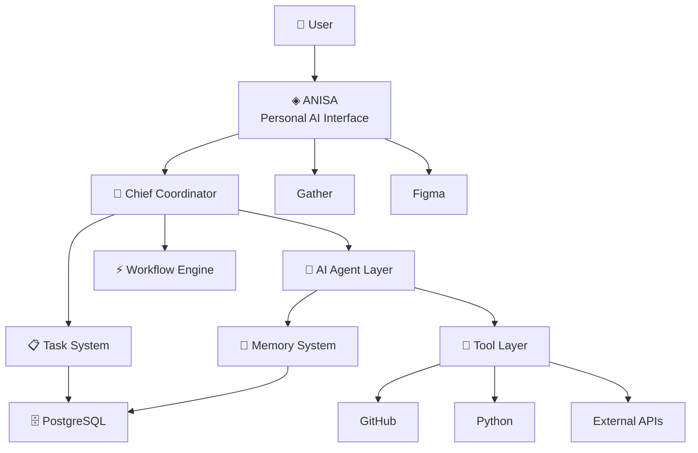

<div align="center">

# ◈ ANISA HQ

### AI OPERATIONS HEADQUARTERS

**A digital headquarters where AI agents think, collaborate, execute and operate as a real organization.**

<br>

[](#)
[](#)
[](#)
[](#)
[](#)
[](#)

<br>

> **ANISA HQ is not another chatbot.**
>
> It is a digital organization built around specialized AI employees, orchestration, memory, tools, workflows and a spatial virtual headquarters.

</div>

---

## 🌐 The Headquarters

<div align="center">


</div>

ANISA HQ represents a new model of software organization:

**humans define objectives → AI plans the work → specialized agents execute → systems verify → humans approve when necessary.**

The headquarters provides the organizational layer that connects everything together.

```text
                         ┌───────────────────┐
                         │       USER        │
                         └─────────┬─────────┘
                                   │
                                   ▼
                         ┌───────────────────┐
                         │      ANISA        │
                         │   AI Assistant    │
                         └─────────┬─────────┘
                                   │
                                   ▼
                    ┌──────────────────────────┐
                    │    CHIEF COORDINATOR     │
                    │   Planning & Delegation  │
                    └────────────┬─────────────┘
                                 │
               ┌─────────────────┼─────────────────┐
               ▼                 ▼                 ▼
        ┌────────────┐    ┌────────────┐    ┌────────────┐
        │ Engineering│    │  Research  │    │ Operations │
        │   Agents   │    │   Agents   │    │   Agents   │
        └──────┬─────┘    └──────┬─────┘    └──────┬─────┘
               │                 │                 │
               └─────────────────┼─────────────────┘
                                 ▼
                       ┌───────────────────┐
                       │       TOOLS       │
                       │ GitHub / APIs /   │
                       │ Python / Services │
                       └─────────┬─────────┘
                                 │
                                 ▼
                       ┌───────────────────┐
                       │      MEMORY       │
                       │ PostgreSQL / KV   │
                       └───────────────────┘
```

---

# 🧭 Navigation

* [What is ANISA HQ?](#-what-is-anisa-hq)
* [Core Philosophy](#-core-philosophy)
* [AI Organization](#-ai-organization)
* [Chief Coordinator](#-chief-coordinator)
* [Architecture](#-architecture)
* [Task System](#-task-system)
* [Memory](#-memory)
* [AI Communication](#-ai-to-ai-communication)
* [Tools & Integrations](#-tools--integrations)
* [ANISA Campus](#-anisa-campus)
* [Figma](#-figma)
* [Human Approval](#-human-approval)
* [Observability](#-observability)
* [Security](#-security)
* [Project Structure](#-project-structure)
* [Roadmap](#-roadmap)
* [Documentation](#-documentation)

---

# 🤖 What is ANISA HQ?

ANISA HQ is a **multi-agent AI operating environment**.

Instead of asking one AI to perform every type of task, ANISA distributes work between specialized AI employees.

Each agent has:

* a role;
* responsibilities;
* tools;
* permissions;
* memory;
* communication channels;
* task context;
* execution rules;
* reporting responsibilities.

The result is an AI organization rather than a single assistant.

---

# 🧠 Core Philosophy

ANISA HQ is built around five principles.

### 01 — Specialization

Every agent has a defined area of expertise.

### 02 — Coordination

Agents do not independently compete for tasks.

The **Chief Coordinator** decides who should work on what.

### 03 — Context

Agents operate with persistent organizational and task context.

### 04 — Verification

Important outputs can be reviewed by another agent or by a human.

### 05 — Human Control

AI can execute autonomously, but sensitive actions can require explicit human approval.

---

# 🏢 AI Organization

<div align="center">


</div>

ANISA HQ treats AI agents as employees inside a digital organization.

## 🎯 Chief Coordinator

**`ai-operations-manager-chief-coordinator`**

The Chief Coordinator is the operational brain of ANISA HQ.

Responsibilities:

* understand the user's objective;
* decompose complex requests;
* create execution plans;
* select appropriate agents;
* distribute tasks;
* monitor progress;
* resolve conflicts;
* validate results;
* request human approval;
* produce the final result.

---

## ⚡ Atlas — Engineering

**Role:** Engineering & Technical Operations

Atlas focuses on:

* backend systems;
* architecture;
* APIs;
* infrastructure;
* technical planning;
* code quality;
* system reliability.

---

## 🎨 Nova — Product & Frontend

**Role:** Frontend & Product Interface

Nova focuses on:

* React applications;
* UI implementation;
* UX;
* design systems;
* responsive interfaces;
* Figma implementation.

---

## 🔎 Iris — Research

**Role:** Research & Intelligence

Iris focuses on:

* web research;
* information gathering;
* competitive analysis;
* technical research;
* source verification;
* knowledge discovery.

---

## ⚙️ Orion — Operations

**Role:** Operations & Execution

Orion focuses on:

* operational workflows;
* task execution;
* automation;
* process management;
* coordination support.

---

## 📚 Vega — Knowledge

**Role:** Documentation & Knowledge Management

Vega focuses on:

* documentation;
* technical specifications;
* reports;
* knowledge bases;
* project documentation;
* organizational memory.

---

# 🎯 Chief Coordinator Workflow

Every complex operation follows a controlled execution pipeline.

```text
USER REQUEST
     │
     ▼
┌───────────────┐
│ UNDERSTANDING │
└───────┬───────┘
        ▼
┌───────────────┐
│    PLANNING   │
└───────┬───────┘
        ▼
┌───────────────┐
│   DELEGATION  │
└───────┬───────┘
        ▼
┌──────────────────────────┐
│    SPECIALIZED AGENTS    │
│                          │
│ Atlas │ Nova │ Iris │    │
│ Orion │ Vega │ ...       │
└───────────┬──────────────┘
            ▼
       ┌───────────┐
       │ EXECUTION │
       └─────┬─────┘
             ▼
       ┌───────────┐
       │  REVIEW   │
       └─────┬─────┘
             ▼
      ┌───────────────┐
      │ HUMAN APPROVAL│
      │   if needed   │
      └───────┬───────┘
              ▼
        FINAL RESULT
```

---

# 🏗️ Architecture

ANISA HQ is intentionally separated into several layers.



---

# 🧩 Runtime Boundaries

One of the most important architectural decisions:

> **Gather is not the AI brain.**

Gather is the **visual spatial interface**.

The actual intelligence lives in the backend.

```text
┌────────────────────────────────────────────┐
│              ANISA HQ BACKEND              │
│                                            │
│  Agent Runtime                             │
│  ├── Coordinator                           │
│  ├── Agent Registry                        │
│  ├── Task Engine                           │
│  ├── Workflow Engine                       │
│  ├── Memory                                │
│  ├── Permissions                           │
│  └── Tool Adapters                         │
│                                            │
└──────────────────────┬─────────────────────┘
                       │
                       │ API / Adapter
                       ▼
┌────────────────────────────────────────────┐
│                GATHER HQ                   │
│                                            │
│       3D / Spatial Presentation Layer      │
│                                            │
│  CEO Office │ Engineering │ Research       │
│  Operations │ Knowledge   │ Command Center │
│                                            │
└────────────────────────────────────────────┘
```

This separation allows the AI organization to continue operating even if the visual layer changes.

---

# 📋 Task System

Tasks are first-class objects inside ANISA HQ.

A task contains:

```text
Task
├── id
├── title
├── description
├── priority
├── status
├── creator
├── assignedAgent
├── dependencies
├── tools
├── memoryContext
├── outputs
├── approvals
├── timestamps
└── executionLogs
```

### Task lifecycle

```text
CREATED
   ↓
PLANNED
   ↓
ASSIGNED
   ↓
IN PROGRESS
   ↓
REVIEW
   ↓
APPROVAL
   ↓
COMPLETED
```

Possible terminal states:

```text
COMPLETED
FAILED
CANCELLED
BLOCKED
```

---

# ⚡ Workflows

ANISA can execute both sequential and parallel operations.

### Sequential

```text
Research
   ↓
Analysis
   ↓
Implementation
   ↓
Testing
   ↓
Documentation
```

### Parallel

```text
                 ┌── Research
                 │
User → Coordinator├── Frontend
                 │
                 ├── Backend
                 │
                 └── Documentation
                         │
                         ▼
                      Review
```

The Coordinator determines which strategy is appropriate.

---

# 🧠 Memory

ANISA HQ has multiple memory layers.

```text
                    MEMORY
                       │
       ┌───────────────┼───────────────┐
       ▼               ▼               ▼
   SHORT-TERM      LONG-TERM       SHARED
       │               │               │
       ▼               ▼               ▼
 Current task      Organization    Team knowledge
 Current context   User context    Agent knowledge
 Conversation      Decisions       Documentation
```

### Short-term memory

Used for the current execution context.

### Long-term memory

Stores durable organizational knowledge.

### Shared memory

Allows agents to access information that belongs to the organization rather than one individual agent.

### Agent memory

Each agent can maintain specialized knowledge relevant to its role.

---

# 💬 AI-to-AI Communication

Agents communicate through structured messages rather than uncontrolled free-form conversations.

Example:

```json
{
  "from": "atlas",
  "to": "nova",
  "type": "task_request",
  "taskId": "TASK-1042",
  "priority": "high",
  "context": {
    "feature": "dashboard",
    "apiStatus": "ready"
  }
}
```

Supported message types may include:

```text
TASK_REQUEST
TASK_UPDATE
TASK_COMPLETED
TASK_FAILED
REVIEW_REQUEST
APPROVAL_REQUEST
INFORMATION_REQUEST
HANDOFF
ALERT
```

---

# 🔌 Tools & Integrations

Agents should not receive unlimited access to external systems.

Every tool is exposed through a controlled adapter.

Current / planned integrations include:

| Integration | Purpose                                   |
| ----------- | ----------------------------------------- |
| GitHub      | Code, repositories, issues, pull requests |
| Python      | Data processing and computation           |
| HTTP APIs   | External services                         |
| PostgreSQL  | Persistent data                           |
| Figma       | Design system and product design          |
| Gather      | Virtual spatial headquarters              |
| Messaging   | Agent/user communication                  |
| Web         | Research and information retrieval        |

---

# 🐙 GitHub Integration

GitHub acts as one of the primary engineering environments.

Agents can potentially:

* inspect repositories;
* analyze code;
* create branches;
* review pull requests;
* create issues;
* update documentation;
* run development workflows;
* report technical findings.

All actions should respect agent permissions.

---

# 🎨 Figma

Figma acts as the visual source of truth for ANISA HQ's product interface.

The design currently includes concepts such as:

* Dashboard;
* Agents;
* Tasks;
* Communications;
* Workflows;
* Architecture Map;
* Integrations;
* ANISA Campus;
* AI employee cards;
* status indicators;
* activity streams;
* approval flows.

The goal is:

```text
Figma
  ↓
Design System
  ↓
Frontend Implementation
  ↓
ANISA Runtime
```

---

# 🏙️ ANISA Campus

<div align="center">


</div>

ANISA Campus is the spatial representation of the AI organization.

Instead of representing agents only as cards in a dashboard, ANISA can represent them as employees operating inside a digital headquarters.

### Planned spaces

```text
ANISA CAMPUS
│
├── 🎯 CEO / Command Center
│
├── 💻 Engineering
│
├── 🔬 Research
│
├── ⚙️ Operations
│
├── 📚 Knowledge
│
└── 🗄 Infrastructure / Server Room
```

The environment is intended to communicate organizational state visually.

For example:

```text
🟢 WORKING
🟡 WAITING
🔵 AVAILABLE
🔴 BLOCKED
⚪ OFFLINE
```

---

# 🖥️ Operations Dashboard

The dashboard represents the operational state of the organization.

It should expose:

* active agents;
* running tasks;
* pending approvals;
* workflow status;
* recent events;
* agent communications;
* failures;
* system health.

The dashboard is not intended to replace the agent runtime.

It is an **observability and control surface**.

---

# 🔐 Human Approval

Autonomous execution does not mean unrestricted execution.

Sensitive actions can require explicit approval.

```text
AGENT
  │
  ▼
ACTION REQUEST
  │
  ▼
PERMISSION CHECK
  │
  ├── SAFE ───────────────► EXECUTE
  │
  └── SENSITIVE
          │
          ▼
    HUMAN APPROVAL
          │
     ┌────┴────┐
     ▼         ▼
  APPROVE    REJECT
     │         │
     ▼         ▼
 EXECUTE     STOP
```

Examples of potentially approval-required actions:

* destructive operations;
* production deployment;
* external communication;
* financial operations;
* permission changes;
* sensitive data operations.

---

# 📡 Observability

Every important operation should be observable.

ANISA HQ should record:

```text
Agent
Task
Workflow
Tool
Action
Duration
Result
Error
Approval
Timestamp
```

This enables:

* debugging;
* auditing;
* performance analysis;
* agent evaluation;
* workflow optimization.

---

# 🛡️ Security

Security is enforced at the architecture level.

Important principles:

### Least privilege

Agents receive only the permissions required for their role.

### Tool isolation

External tools are accessed through controlled adapters.

### Secret isolation

API keys and credentials are never stored inside agent prompts.

### Approval boundaries

Sensitive operations can require human authorization.

### Auditability

Important actions are logged.

---

# 📁 Project Structure

A target structure:

```text
anisa-hq/
│
├── apps/
│   ├── web/
│   ├── dashboard/
│   └── campus/
│
├── services/
│   ├── coordinator/
│   ├── agents/
│   ├── tasks/
│   ├── workflows/
│   ├── memory/
│   └── communications/
│
├── agents/
│   ├── chief-coordinator/
│   ├── atlas/
│   ├── nova/
│   ├── iris/
│   ├── orion/
│   └── vega/
│
├── integrations/
│   ├── github/
│   ├── figma/
│   ├── gather/
│   ├── python/
│   └── http/
│
├── database/
│
├── shared/
│
├── docs/
│
├── assets/
│
└── README.md
```

The actual repository structure may evolve as implementation progresses.

---

# 📊 Organizational State

ANISA HQ should make the organization observable in real time.

Example:

```text
┌─────────────────────────────────────────────┐
│              ANISA HQ STATUS                │
├─────────────────────────────────────────────┤
│                                             │
│  AGENTS                                     │
│  ● Atlas      WORKING                       │
│  ● Nova       WORKING                       │
│  ● Iris       RESEARCHING                   │
│  ● Orion      AVAILABLE                    │
│  ● Vega       DOCUMENTING                  │
│                                             │
│  TASKS                                      │
│  ███████████████░░░  8 Active              │
│  ████████░░░░░░░░░░  4 Waiting             │
│                                             │
│  APPROVALS                                  │
│  ⚠ 2 actions require attention             │
│                                             │
└─────────────────────────────────────────────┘
```

---

# 🧬 Agent Lifecycle

Every agent follows a controlled lifecycle.

```text
DEFINED
   ↓
REGISTERED
   ↓
AVAILABLE
   ↓
ASSIGNED
   ↓
EXECUTING
   ↓
REPORTING
   ↓
AVAILABLE
```

If execution fails:

```text
EXECUTING
   ↓
FAILED
   ↓
RETRY / ESCALATE / STOP
```

---

# 🧩 Adding a New Agent

A new agent should define:

```text
Agent
├── identity
├── role
├── responsibilities
├── capabilities
├── tools
├── permissions
├── memory
├── communication
├── task types
├── system instructions
└── evaluation criteria
```

Example:

```yaml
name: security-agent

role: Security Engineering

responsibilities:
  - security review
  - dependency analysis
  - vulnerability detection

tools:
  - github
  - code-analysis

permissions:
  - repository:read
```

---

# 🗺️ Roadmap

## Phase 01 — Foundation

* [x] ANISA HQ concept
* [x] Multi-agent architecture
* [x] Chief Coordinator concept
* [x] Agent roles
* [x] Figma architecture
* [ ] Production backend
* [ ] Agent registry
* [ ] Task engine

## Phase 02 — Intelligence

* [ ] Agent runtime
* [ ] Memory system
* [ ] Agent-to-agent communication
* [ ] Workflow engine
* [ ] Tool permissions
* [ ] Evaluation system

## Phase 03 — Operations

* [ ] Real-time dashboard
* [ ] Observability
* [ ] Approval system
* [ ] GitHub automation
* [ ] External API integrations

## Phase 04 — ANISA Campus

* [ ] Gather integration
* [ ] 3D/spatial headquarters
* [ ] Agent presence
* [ ] Agent status visualization
* [ ] Interactive rooms
* [ ] Activity visualization

## Phase 05 — Autonomous Organization

* [ ] Long-running workflows
* [ ] Proactive agents
* [ ] Organizational memory
* [ ] Self-monitoring
* [ ] Agent evaluation
* [ ] Dynamic team composition

---

# 📚 Documentation

| Document              | Purpose                 |
| --------------------- | ----------------------- |
| `README.md`           | Project overview        |
| `ARCHITECTURE.md`     | System architecture     |
| `AGENTS.md`           | AI employee definitions |
| `docs/COORDINATOR.md` | Chief Coordinator       |
| `docs/MEMORY.md`      | Memory architecture     |
| `docs/TASKS.md`       | Task system             |
| `docs/WORKFLOWS.md`   | Workflow engine         |
| `docs/TOOLS.md`       | Tool system             |
| `docs/SECURITY.md`    | Security model          |
| `docs/CAMPUS.md`      | ANISA Campus            |

---

# 🧠 The Core Idea

ANISA HQ is built around one simple idea:

> **AI should not only answer questions. AI should be able to operate as an organization.**

A single model can generate an answer.

An organization can:

```text
Understand
   ↓
Plan
   ↓
Delegate
   ↓
Execute
   ↓
Communicate
   ↓
Review
   ↓
Remember
   ↓
Improve
```

That is the purpose of ANISA HQ.

---

# 🌌 Vision

<div align="center">


### BUILDING A DIGITAL ORGANIZATION

**One assistant.
Many specialists.
One coordinated intelligence.**

</div>

---

# ⭐ ANISA HQ

<div align="center">

**AI Operations Headquarters**

*Where AI agents become a team.*

<br>

[Architecture](ARCHITECTURE.md) ·
[Agents](AGENTS.md) ·
[Documentation](docs/)

</div>
